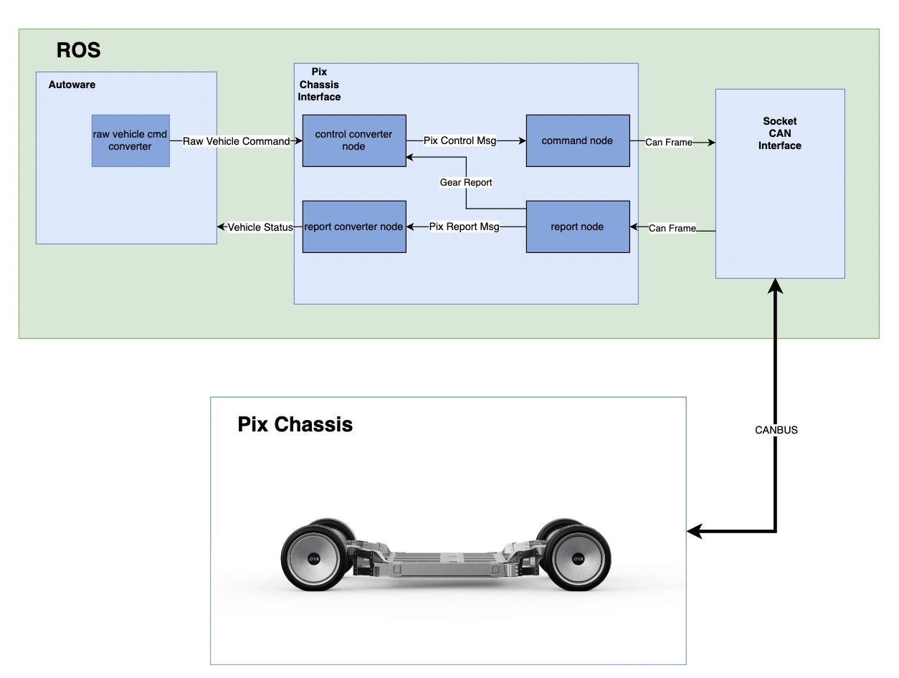

# Pix Chassis Interface 

## Overview

[Pixmoving](https://www.pixmoving.com) chassis are [driving-by-wire/DbW](https://en.wikipedia.org/wiki/Drive_by_wire) chassis, which are compatible with self-driving systems. We had designed an interface for [Autoware.universe](https://github.com/autowarefoundation/autoware.universe).

### Notice
> For the source code, please refer to [pix_driver](https://github.com/pixmoving-moveit/pix_driver).

> Before you can use the interface, make sure you have already installed and launched [ros2_socketcan](https://github.com/autowarefoundation/ros2_socketcan/tree/1.1.0) in your workspace.
## Role

There are three main functions for Pix Chasssis Interface:

- **Translation between CAN frames and pix_robobus_driver_msgs**
- **Conversion of Autoware commands to pix_robobus_driver_msgs**
- **Conversion of vehicle status in pix_ro bo bu s_driver_msgs to Autoware messages**

## Software Design

## Control Command Node

### Input

#### **The input to Control Command Node**

| Input           | Topic(Data Type)                                                   | Explanation |
| --------------- | ------------------------------------------------------------------ | ----------- |
|autonomous driving to vehicle drive control|`/pix_robobus/throttle_command` ([pix_robobus_driver_msgs/msg/ThrottleCommand](https://github.com/pixmoving-moveit/pix_driver/blob/robobus/pix_robobus_driver_msgs/msg/ThrottleCommand.msg))|[throttle_command](#throttle_command)|
|autonomous driving to vehicle brake control|`/pix_robobus/brake_command`||
## Report Parser Node
## Control Converter Node
## Report Converter Node