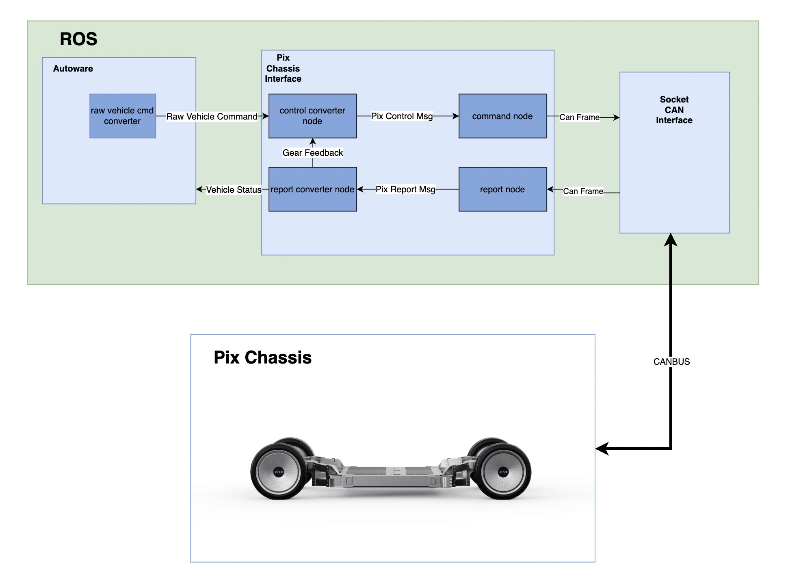

# Pix Chassis Interface 

# Overview

[Pixmoving](https://www.pixmoving.com) chassis are [driving-by-wire/DbW](https://en.wikipedia.org/wiki/Drive_by_wire) chassis, which are compatible with self-driving systems. We had designed an interface for [Autoware Architecture Proposal](https://github.com/tier4/AutowareArchitectureProposal.proj/tree/v0.9.1).

## Role

There are three main functions for Pix Chasssis Interface:

- **Translation between CAN frames and pix_hooke_driver_msgs**
- **Conversion of Autoware commands to pix_hooke_driver_msgs**
- **Conversion of vehicle status in pix_hooke_driver_msgs to Autoware messages**

## Software Design

## Command Node

### Input

**The input to Command Node**

| Input           | Topic(Data Type)                                                   | Explanation |
| --------------- | ------------------------------------------------------------------ | ----------- |
| autonomous driving to vehicle drive control| `/pix_hooke/a2v_drivectrl_130` (`pix_hooke_msgs/a2v_drivectrl_130.msg`) | table below |
| autonomous driving to vehicle brake control|`/pix_hooke/a2v_brakectrl_131` (`pix_hooke_msgs/a2v_brakectrl_131.msg` |table below |
| autonomous driving to vehicle steering control |`/pix_hooke/a2v_steerctrl_132` (`pix_hooke_msgs/a2v_steerctrl_132.msg` |table below |
| autonomous driving to vehicle control|`/pix_hooke/a2v_vehiclectrl_133` (`pix_hooke_msgs/a2v_vehiclectrl_133.msg` |table below |
| autonomous driving to vehicle motor control|`/pix_hooke/a2v_wheelctrl_135` (`pix_hooke_msgs/a2v_wheelctrl_135.msg` |table below |

**The detailed contents in `self-driving to vehicle drive control` are as follows.**

| Input                  | Data Type        | Explanation                            |
| ----------------------- | ---------------- | -----------                            |
| header | std_msgs/Header | header                   |
| ACU_ChassisDriverEnCtrl  | std_msgs/int8 | enable/disable longitudinal acceleration contrl `{0: 'ACU_CHASSISDRIVERENCTRL_DISABLE', 1: 'ACU_CHASSISDRIVERENCTRL_ENABLE'}` |
| ACU_ChassisDriverModeCtrl | std_msgs/int8 |  target control mode `{0: 'ACU_CHASSISDRIVERMODECTRL_SPEED_CTRL_MODE', 1: 'ACU_CHASSISDRIVERMODECTRL_THROTTLE_CTRL_MODE', 2: 'ACU_CHASSISDRIVERMODECTRL_RESERVE', 3: 'ACU_CHASSISDRIVERMODECTRL_RESERVE'}` |
| ACU_ChassisGearCtrl | std_msgs/int8 | target gear `{0: 'ACU_CHASSISGEARCTRL_DEFAULT_N', 1: 'ACU_CHASSISGEARCTRL_D', 2: 'ACU_CHASSISGEARCTRL_N', 3: 'ACU_CHASSISGEARCTRL_R'}` |
| ACU_ChassisSpeedCtrl | std_msgs/float32 | Target velocity [m/s] |
| ACU_ChassisThrottlePdlTarget | std_msgs/float32 | target accel pedal value `0.0-100.0` |

**The detailed contents in `self-driving to vehicle brake control` are as follows.**

| Input                  | Data Type        | Explanation                            |
| ----------------------- | ---------------- | -----------                            |
| header                | std_msgs/Header | header                   |
| ACU_ChassisBrakeEn  | std_msgs/int8 | enable/disable longitudinal deacceleration contrl `0: 'ACU_CHASSISBRAKEEN_DISABLE', 1: 'ACU_CHASSISBRAKEEN_ENABLE'` |
| ACU_ChassisAebCtrl | std_msgs/int8 | enable/disable AEB `0: 'ACU_CHASSISAEBCTRL_DISABLE', 1: 'ACU_CHASSISAEBCTRL_ENABLE'`|
| ACU_ChassisBrakePdlTarget | std_msgs/float32 | target brake pedal value `0.0-100.0`|
| ACU_ChassisEpbCtrl | std_msgs/int8 |parking brake control `0: 'ACU_CHASSISEPBCTRL_DEFAULT', 1: 'ACU_CHASSISEPBCTRL_BRAKE', 2: 'ACU_CHASSISEPBCTRL_RELEASE'`|

**The detailed contents in `self-driving to vehicle steering control` are as follows.**

| Input                  | Data Type        | Explanation                            |
| ----------------------- | ---------------- | -----------                            |
| header                | std_msgs/Header | header                   |
| ACU_ChassisSteerEnCtrl  | std_msgs/int8 | enable/disable lateral/steering contrl `{0: 'ACU_CHASSISSTEERENCTRL_DISABLE', 1: 'ACU_CHASSISSTEERENCTRL_ENABLE'}` |
| ACU_ChassisSteerModeCtrl | std_msgs/int8 | steering mode `{0: 'ACU_CHASSISSTEERMODECTRL_FRONT_ACKERMAN', 1: 'ACU_CHASSISSTEERMODECTRL_SAME_FRONT_AND_BACK', 2: 'ACU_CHASSISSTEERMODECTRL_FRONT_DIFFERENT_BACK', 3: 'ACU_CHASSISSTEERMODECTRL_BACK_ACKRMAN', 4: 'ACU_CHASSISSTEERMODECTRL_FRONT_BACK'}` |
| ACU_ChassisSteerAngleTarget | std_msgs/int32 | target steering angle, `-500=500 left to right`. When `ACU_ChassisSteerModeCtrl=ACU_CHASSISSTEERMODECTRL_FRONT_BACK`, `ACU_ChassisSteerAngleTarget` can only control front wheels |
| ACU_ChassisSteerAngleRearTarget | std_msgs/int32 |target rear steering angle. `-500-500`. Works only when `ACU_ChassisSteerModeCtrl=ACU_CHASSISSTEERMODECTRL_FRONT_BACK` |
| ACU_ChassisSteerAngleSpeedCtrl | std_msgs/float32 |target steering speed `0-500` |

**The detailed contents in `self-driving to vehicle Vehicle Control` are as follows.**

| Input                  | Data Type        | Explanation                            |
| ----------------------- | ---------------- | -----------                            |
| header                | std_msgs/Header | header |
| ACU_VehiclePosLampCtrl  | std_msgs/int8 | positioning lamp contorl `{0: 'ACU_VEHICLEPOSLAMPCTRL_OFF', 1: 'ACU_VEHICLEPOSLAMPCTRL_ON'}`|
| ACU_VehicleHeadLampCtrl | std_msgs/int8 | head lamp control `{0: 'ACU_VEHICLEHEADLAMPCTRL_OFF', 1: 'ACU_VEHICLEHEADLAMPCTRL_ON'}`|
| ACU_VehicleLeftLampCtrl | std_msgs/int8 | left lamp control `{0: 'ACU_VEHICLELEFTLAMPCTRL_OFF', 1: 'ACU_VEHICLELEFTLAMPCTRL_ON'}`|
| ACU_VehicleRightLampCtrl | std_msgs/int8 | right lamp control `{0: 'ACU_VEHICLERIGHTLAMPCTRL_OFF', 1: 'ACU_VEHICLERIGHTLAMPCTRL_ON'}`|
| ACU_VehicleHighBeamCtrl | std_msgs/int8 | vehicle high beam control `{0: 'ACU_VEHICLEHIGHBEAMCTRL_OFF', 1: 'ACU_VEHICLEHIGHBEAMCTRL_ON'}`|
| ACU_VehicleFogLampCtrl | std_msgs/int8 | fog lamp control `{0: 'ACU_VEHICLEFOGLAMPCTRL_OFF', 1: 'ACU_VEHICLEFOGLAMPCTRL_ON'}`|
| ACU_VehicleBodyLightCtrl| std_msgs/int8| body light control `{0: 'ACU_VEHICLEBODYLIGHTCTRL_OFF', 1: 'ACU_VEHICLEBODYLIGHTCTRL_ON'}`|
| ACU_VehicleReadLightCtrl| std_msgs/int8| reading light control (reserved) `{0: 'ACU_VEHICLEREADLIGHTCTRL_OFF', 1: 'ACU_VEHICLEREADLIGHTCTRL_ON'}`|
| ACU_VehicleVoice| std_msgs/int8| vehicle voice control (reserved) `{0: 'ACU_VEHICLEVOICE_OFF', 1: 'ACU_VEHICLEVOICE_TURN_LEFT', 2: 'ACU_VEHICLEVOICE_TURN_RIGHT', 3: 'ACU_VEHICLEVOICE_BACKWARD'}`|
|ACU_VehicleWipersCtrl | std_msgs/int8| wipers control (reserved) `{0: 'ACU_VEHICLEWIPERSCTRL_OFF', 1: 'ACU_VEHICLEWIPERSCTRL_LOW', 2: 'ACU_VEHICLEWIPERSCTRL_MID', 3: 'ACU_VEHICLEWIPERSCTRL_HIGH'}`|
| ACU_VehicleDoorCtrl | std_msgs/int8| door control (reserved) `{0: 'ACU_VEHICLEDOORCTRL_DEFAULT', 1: 'ACU_VEHICLEDOORCTRL_CLOSE', 2: 'ACU_VEHICLEDOORCTRL_OPEN'}`|
| ACU_VehicleWindowCtrl| std_msgs/int8| window control (reserved) `{0: 'ACU_VEHICLEWINDOWCTRL_DEFAULT', 1: 'ACU_VEHICLEWINDOWCTRL_CLOSE', 2: 'ACU_VEHICLEWINDOWCTRL_OPEN'}`|
|ACU_ChassisSpeedLimiteMode | std_msgs/int8| speed limit model `{0: 'ACU_CHASSISSPEEDLIMITEMODE_DEFAULT', 1: 'ACU_CHASSISSPEEDLIMITEMODE_LIMIT'}`|
|ACU_ChassisSpeedLimiteVal | std_msgs/int32| velocity limit control `m/s` |

**The detailed contents in `self-driving to vehicle steering control` are as follows.**

| Input                  | Data Type        | Explanation                            |
| ----------------------- | ---------------- | -----------                            |
| header                | std_msgs/Header | header                   |
| ACU_MotorTorqueLfCtrl | std_smgs/float32 | left front motor torque control [Nm] `-200.0-200.0` |
| ACU_MotorTorqueRfCtrl | std_smgs/float32 | right front motor torque control [Nm] `-200.0-200.0` |
| ACU_MotorTorqueLrCtrl | std_smgs/float32 | left rear motor torque control [Nm] `-200.0-200.0` |
| ACU_MotorTorqueRrCtrl | std_smgs/float32 | right rear motor torque control [Nm] `-200.0-200.0` |

### Output

**The ouputs of `Command Node` are `can_msgs/Frame` to `Socket CAN Interface`.**

| Output (to Autoware)          | Topic(Data Type)                                                      | Explanation                                 |
| ---------------               | ------------------------------------------------------------------    | ------------------------                    |
| can frame      | `/sent_messages` (`can_msgs/Frame`) | control command in CAN Frams |

## Report Node
### Input
**The inputs of `Report Node` are `can_msgs/Frame` from `Socket CAN Interface`.**

| Output (to Autoware)          | Topic(Data Type)                                                      | Explanation                                 |
| ---------------               | ------------------------------------------------------------------    | ------------------------                    |
| can frame      | `/received_messages` (`can_msgs/Frame`) | control command in CAN Frams |

### Output

**The outputs of Report Node**

| Input           | Topic(Data Type)                                                   | Explanation |
| --------------- | ------------------------------------------------------------------ | ----------- |
| vehicle to autonomous driving drive status feedback | `/pix_hooke/v2a_drivestafb` (`pix_hooke_msgs/v2a_drivestafb_530.msg`) | table below |
| vehicle to autonomous driving brake status feedback |`/pix_hooke/v2a_brakestafb` (`pix_hooke_msgs/v2a_brakestafb_531.msg` | table below |
| vehicle to autonomous driving steering status feedback |`/pix_hooke/v2a_steerstafb` (`pix_hooke_msgs/v2a_steerstafb_532.msg` | table below |
| vehicle to autonomous driving vehicle working status feedback |`/pix_hooke/v2a_vehicleworkstafb` (`pix_hooke_msgs/v2a_vehicleworkstafb_534.msg` | table below |
| vehicle to autonomous driving power status feedback |`/pix_hooke/v2a_powerstafb` (`pix_hooke_msgs/v2a_powerstafb_535.msg` | table below |
| vehicle to autonomous driving vehicle status feedback |`/pix_hooke/v2a_vehiclestafb` (`pix_hooke_msgs/v2a_vehiclestafb_536.msg` | table below |
| vehicle to autonomous driving vehicle fault status feedback |`/pix_hooke/v2a_vehiclefltsta` (`pix_hooke_msgs/v2a_vehiclefltsta_537.msg` | table below |
| vehicle to autonomous driving chassis wheel speed feedback |`/pix_hooke/v2a_chassiswheelrpmfb` (`pix_hooke_msgs/v2a_chassiswheelrpmfb_539.msg` | table below |
| vehicle to autonomous driving tire pressure feedback |`/pix_hooke/v2a_chassiswheeltirepressfb` (`pix_hooke_msgs/v2a_chassiswheeltirepressfb_540.msg` | table below |
| vehicle to autonomous driving wheel angle feedback |`/pix_hooke/v2a_chassiswheelanglefb` (`pix_hooke_msgs/v2a_chassiswheelanglefb_541.msg` | table below |

**The detailed contents in `vehicle to autonomous driving working status feedback` are as follows.**

| Input                  | Data Type        | Explanation                            |
| ----------------------- | ---------------- | -----------                            |
| header | std_msgs/Header | header                   |
| VCU_ChassisDriverEnSta  | std_msgs/int8 | drive enable status feedback `{0: 'VCU_CHASSISDRIVERENSTA_DISABLE', 1: 'VCU_CHASSISDRIVERENSTA_ENABLE'}` |
| VCU_ChassisDiverSlopover | std_msgs/int8 | drive Slop-over status feedback  `{0: 'VCU_CHASSISDIVERSLOPOVER_NORMAL', 1: 'VCU_CHASSISDIVERSLOPOVER_OVER_SLOP'}` |
| VCU_ChassisDriverModeSta | std_msgs/int8 | drive mode feedback `{0: 'VCU_CHASSISDRIVERMODESTA_SPEED_CTRL_MODE', 1: 'VCU_CHASSISDRIVERMODESTA_THROTTLE_CTRL_MODE', 2: 'VCU_CHASSISDRIVERMODESTA_RESERVE', 3: 'VCU_CHASSISDRIVERMODESTA_RESERVE'}` |
| VCU_ChassisGearFb | std_msgs/int8 | gear feedback `{0: 'VCU_CHASSISGEARFB_NO_USE', 1: 'VCU_CHASSISGEARFB_D', 2: 'VCU_CHASSISGEARFB_N', 3: 'VCU_CHASSISGEARFB_R'}` |
| VCU_ChassisSpeedFb | std_msgs/float32 | speed feedback [m/s] `-50.0-50.0` |
| VCU_ChassisThrottlePaldFb | std_msgs/float32 | pedal value feedback `0.0-100.0` |
| VCU_ChassisAccelerationFb | std_msgs/float32 | target accel pedal value [m/s2] `-20.0-20.0` |

**The detailed contents in `vehicle to autonomous driving braking status feedback` are as follows.**

| Input                  | Data Type        | Explanation                            |
| ----------------------- | ---------------- | -----------                            |
| header | std_msgs/Header | header                   |
| VCU_ChassisBrakeEnSta  | std_msgs/int8 | braking enable status feedback `{0: 'VCU_CHASSISBRAKEENSTA_DISABLE', 1: 'VCU_CHASSISBRAKEENSTA_ENABLE'}` |
| VCU_VehicleBrakeLampFb | std_msgs/int8 | braking lamp status feedback  `{0: 'VCU_VEHICLEBRAKELAMPFB_OFF', 1: 'VCU_VEHICLEBRAKELAMPFB_ON'}` |
| VCU_ChassisEpbFb | std_msgs/int8 | EPB/Parking Brake status feedback `{0: 'VCU_CHASSISEPBFB_RELEASE', 1: 'VCU_CHASSISEPBFB_BRAKE', 2: 'VCU_CHASSISEPBFB_RELEASING', 3: 'VCU_CHASSISEPBFB_BRAKING'}` |
| VCU_ChassisBrakePadlFb | std_msgs/float32 | braking pedal value feedback `0-100` |
| VCU_AebEnStaFb | std_msgs/int8 | AEB enable status feedback `{0: 'VCU_AEBENSTAFB_OFF', 1: 'VCU_AEBENSTAFB_ON'}` |
| VCU_AebTriggerStaFb | std_msgs/int8 | AEB triggered status feedback `{0: 'VCU_AEBTRIGGERSTAFB_OFF', 1: 'VCU_AEBTRIGGERSTAFB_AEB_TRIGGER'}` |

**The detailed contents in `vehicle to autonomous driving steering status feedback` are as follows.**

| Input                  | Data Type        | Explanation                            |
| ----------------------- | ---------------- | -----------                            |
| header | std_msgs/Header | header |
| VCU_ChassisSteerEnSta | std_msgs/int8 | steering control enable status feedback `{0: 'VCU_CHASSISSTEERENSTA_DISABLE', 1: 'VCU_CHASSISSTEERENSTA_ENABLE'}` |
| VCU_ChassisSteerSlopover | std_msgs/int8 | steering slop-over status feedback `{0: 'VCU_CHASSISSTEERSLOPOVER_NORMAL', 1: 'VCU_CHASSISSTEERSLOPOVER_OVER_SLOP'}` |
| VCU_ChassisSteerWorkMode | std_msgs/int8 | steering work mode feedback `{0: 'VCU_CHASSISSTEERWORKMODE_MACHINE', 1: 'VCU_CHASSISSTEERWORKMODE_WIRE', 2: 'VCU_CHASSISSTEERWORKMODE_POWER'}` |
| VCU_ChassisSteerWorkMode | std_msgs/int8 | steering mode feedback `{0: 'VCU_CHASSISSTEERMODEFB_FRONT_ACKERMAN', 1: 'VCU_CHASSISSTEERMODEFB_SAME_FRONT_AND_BACK', 2: 'VCU_CHASSISSTEERMODEFB_FRONT_DIFFERENT_BACK', 3: 'VCU_CHASSISSTEERMODEFB_BACK_ACKRMAN', 4: 'VCU_CHASSISSTEERMODEFB_FRONT_BACK'}` |
| VCU_ChassisSteerAngleFb | std_msgs/int32 | steering angle of front steering wheel [deg] `-500-500` |
| VCU_ChassisSteerAngleRearFb | std_msgs/int32 | steering angle of rear steering wheel [deg] `-500-500` |
| VCU_ChassisSteerAngleSpeedFb | std_msgs/float32 | angular speed of steering wheel [deg/s] `0-500` |

**The detailed contents in `vehicle to autonomoust driving vehicle work status feedback` are as follows.**

| Input                  | Data Type        | Explanation                            |
| ----------------------- | ---------------- | -----------                            |
| header | std_msgs/Header | header |
| VCU_DrivingModeFb | std_msgs/int8 | vcu driving mode feedback `{0: 'VCU_DRIVINGMODEFB_STANDBY', 1: 'VCU_DRIVINGMODEFB_SELF_DRIVING', 2: 'VCU_DRIVINGMODEFB_REMOTE', 3: 'VCU_DRIVINGMODEFB_MAN'}` |
| VCU_ChassisPowerStaFb | std_msgs/int8 | power status feedback `{0: 'VCU_CHASSISPOWERSTAFB_INIT', 1: 'VCU_CHASSISPOWERSTAFB_ON_ACC', 2: 'VCU_CHASSISPOWERSTAFB_READY', 3: 'VCU_CHASSISPOWERSTAFB_OFF'}` |
| VCU_ChassisPowerDcSta | std_msgs/int8 | DC working status feedback `{0: 'VCU_CHASSISPOWERDCSTA_OFF', 1: 'VCU_CHASSISPOWERDCSTA_ON', 2: 'VCU_CHASSISPOWERDCSTA_STANDBY'}` |
| VCUChassisSpeedLimitedModeFb | std_msgs/int8 | speed limit mode status feedback `{0: 'VCU_CHASSISSPEEDLIMITEDMODEFB_DEFAULT', 1: 'VCU_CHASSISSPEEDLIMITEDMODEFB_LIMIT'}` |
| VCU_ChassisPowerLimiteSta | std_msgs/int8 | power limit status feedback `{0: 'VCU_CHASSISPOWERLIMITESTA_DEFAULT', 1: 'VCU_CHASSISPOWERLIMITESTA_LIMIT'}` |
| VCU_SysEcoMode | std_msgs/int8 | Eco mode feedback `{0: 'VCU_SYSECOMODE_DEFAULT', 1: 'VCU_SYSECOMODE_ECO', 2: 'VCU_SYSECOMODE_SPORT'}` |
| VCU_ChassisSpeedLimitedValFb | std_msgs/float32 | speed limit feedback [m/s] `0.0-50.0` |
| VCU_ChassisLowPowerVoltSta | std_msgs/float32 | low-voltage/small battery voltage status feedback [V] `0-25` |
| VCU_ChassisEStopStaFb | std_msgs/int8 | E-stop status feedback `{0: 'VCU_CHASSISESTOPSTAFB_NO', 1: 'VCU_CHASSISESTOPSTAFB_CHASSIS_ESTOP', 2: 'VCU_CHASSISESTOPSTAFB_REMOTE_ESTOP', 3: 'VCU_CHASSISESTOPSTAFB_CHASSIS_ERR_ESTOP'}` |
| VCU_CrashFrontSta | std_msgs/int8 | front crash status feedback `{0: 'VCU_CRASHFRONTSTA_OFF', 1: 'VCU_CRASHFRONTSTA_COLLIDE'}` |
| VCU_CrashRearSta | std_msgs/int8 | rear crash status feedback `{0: 'VCU_CRASHREARSTA_OFF', 1: 'VCU_CRASHREARSTA_COLLIDE'}` |
| VCU_CrashRightSta | std_msgs/int8 | right crash status feedback `{0: 'VCU_CRASHLEFTSTA_OFF', 1: 'VCU_CRASHLEFTSTA_COLLIDE'}` |
| VCU_Life | std_msgs/int32 | life cycle count `0-255` |
| VCU_CheckSum | std_msgs/int32 | check sum |

**The detailed contents in `vehicle to autonomoust driving power status feedback` are as follows.**

| Input                  | Data Type        | Explanation                            |
| ----------------------- | ---------------- | -----------                            |
| header | std_msgs/Header | header |
| VCU_ChassisBmsReserved_1 | std_msgs/int32 | reserved position |
| VCU_ChassisPowerChargeSta | std_msgs/int8 | charging status feedback `{0: 'VCU_CHASSISPOWERCHARGESTA_NO_CHARGE', 1: 'VCU_CHASSISPOWERCHARGESTA_CHARGE', 2: 'VCU_CHASSISPOWERCHARGESTA_CHARGE_FULL'}` |
| VCU_ChassisPowerChargeSockSta | std_msgs/int8 | charging socket status feedback `{0: 'VCU_CHASSISPOWERCHARGESOCKSTA_NO_CONNECT', 1: 'VCU_CHASSISPOWERCHARGESOCKSTA_CONNECT'}` |
| VCU_ChassisPowerSocFb | std_msgs/int32 | power battery SOC feedback [%] `0-100`|
| VCU_ChassisPowerVoltFb | std_msgs/float32 | power battery voltage feedback [V] `0.0-1000.0` |
| VCU_ChassisPowerCurrFb | std_msgs/float32 | power battery current feedback [A] `-1000.0-1000.0` |
| VCU_ChassisBmsMaxTemp | std_msgs/int32 | BMX max temperature feedback [°C] `-40-80`|
| VCU_ChassisBmsReserved_2 | std_msgs/int32 | reserved position |

**The detailed contents in `vehicle to autonomoust driving vehicle status feedback` are as follows.**

| Input                  | Data Type        | Explanation                            |
| ----------------------- | ---------------- | -----------                            |
| header | std_msgs/Header | header                   |
| VCU_VehiclePosLampFb  | std_msgs/int8 | Positioning lamp feedback `{0: 'VCU_VEHICLEPOSLAMPFB_OFF', 1: 'VCU_VEHICLEPOSLAMPFB_ON'}` |
| VCU_VehicleHeadLampFb | std_msgs/int8 | head lamp feedback `{0: 'VCU_VEHICLEHEADLAMPFB_OFF', 1: 'VCU_VEHICLEHEADLAMPFB_ON'}` |
| VCU_VehicleLeftLampFb | std_msgs/int8 | left lamp feedback `{0: 'VCU_VEHICLELEFTLAMPFB_OFF', 1: 'VCU_VEHICLELEFTLAMPFB_ON'}` |
| VCU_VehicleRightLampFb | std_msgs/int8 | right lamp feedback `{0: 'VCU_VEHICLERIGHTLAMPFB_OFF', 1: 'VCU_VEHICLERIGHTLAMPFB_ON'}` |
| VCU_VehicleHighBeamFb | std_msgs/int8 | high beam feedback `{0: 'VCU_VEHICLEHIGHBEAMFB_OFF', 1: 'VCU_VEHICLEHIGHBEAMFB_ON'}` |
| VCU_VehicleFogLampFb | std_msgs/int8 | fog lamp feedback `{0: 'VCU_VEHICLEFOGLAMPFB_OFF', 1: 'VCU_VEHICLEFOGLAMPFB_ON'}` |
| VCU_VehicleHazardWarLampFb | std_msgs/int8 | hazard warning lamp feedback `{0: 'VCU_VEHICLEHAZARDWARLAMPFB_OFF', 1: 'VCU_VEHICLEHAZARDWARLAMPFB_ON'}` |
| VCU_VehicleBodyLampFb | std_msgs/int8 | body lamp feedback `{0: 'VCU_VEHICLEBODYLAMPFB_OFF', 1: 'VCU_VEHICLEBODYLAMPFB_ON'}` |
| VCU_VehicleReadLampFb | std_msgs/int8 | reading lamp feedback `{0: 'VCU_VEHICLEREADLAMPFB_OFF', 1: 'VCU_VEHICLEREADLAMPFB_ON'}` |
| ACU_VehicleWindowFb | std_msgs/int8 | window feedback `{0: 'ACU_VEHICLEWINDOWFB_INVALID', 1: 'ACU_VEHICLEWINDOWFB_OPENING', 2: 'ACU_VEHICLEWINDOWFB_CLOSING', 3: 'ACU_VEHICLEWINDOWFB_OPEN_INPLACE', 4: 'ACU_VEHICLEWINDOWFB_CLOSE_INPLACE', 5: 'ACU_VEHICLEWINDOWFB_OPEN_TIMEOUT', 6: 'ACU_VEHICLEWINDOWFB_CLOSE_TIMEOUT'}` |
| VCU_VehicleDoorStaFb | std_msgs/int8 | door status feedback `{0: 'VCU_VEHICLEDOORSTAFB_INVALID', 1: 'VCU_VEHICLEDOORSTAFB_OPENING', 2: 'VCU_VEHICLEDOORSTAFB_CLOSING', 3: 'VCU_VEHICLEDOORSTAFB_OPEN_INPLACE', 4: 'VCU_VEHICLEDOORSTAFB_CLOSE_INPLACE', 5: 'VCU_VEHICLEDOORSTAFB_OPEN_TIMEOUT', 6: 'VCU_VEHICLEDOORSTAFB_CLOSE_TIMEOUT'}` |
| VCU_VehicleWipersStaFb | std_msgs/int8 | wiper status feedback `{0: 'VCU_VEHICLEWIPERSSTAFB_OFF', 1: 'VCU_VEHICLEWIPERSSTAFB_LOW', 2: 'VCU_VEHICLEWIPERSSTAFB_MID', 3: 'VCU_VEHICLEWIPERSSTAFB_HIGH'}` |
| VCU_VehicleSafetyBelt1 | std_msgs/int8 | safty belt 1 feedback `{0: 'VCU_VEHICLESAFETYBELT1_NO', 1: 'VCU_VEHICLESAFETYBELT1_SIT', 2: 'VCU_VEHICLESAFETYBELT1_SAFETYBELT', 3: 'VCU_VEHICLESAFETYBELT1_UNKNOW_SENSOR_ERROR'}` |
| VCU_VehicleSafetyBelt2 | std_msgs/int8 | safty belt 2 feedback `{0: 'VCU_VEHICLESAFETYBELT2_NO', 1: 'VCU_VEHICLESAFETYBELT2_SIT', 2: 'VCU_VEHICLESAFETYBELT2_SAFETYBELT', 3: 'VCU_VEHICLESAFETYBELT2_UNKNOW_SENSOR_ERROR'}` |
| VCU_VehicleSafetyBelt3 | std_msgs/int8 | safty belt 3 feedback `{0: 'VCU_VEHICLESAFETYBELT3_NO', 1: 'VCU_VEHICLESAFETYBELT3_SIT', 2: 'VCU_VEHICLESAFETYBELT3_SAFETYBELT', 3: 'VCU_VEHICLESAFETYBELT3_UNKNOW_SENSOR_ERROR'}` |
| VCU_VehicleSafetyBelt4 | std_msgs/int8 | safty belt 4 feedback `{0: 'VCU_VEHICLESAFETYBELT4_NO', 1: 'VCU_VEHICLESAFETYBELT4_SIT', 2: 'VCU_VEHICLESAFETYBELT4_SAFETYBELT', 3: 'VCU_VEHICLESAFETYBELT4_UNKNOW_SENSOR_ERROR'}` |

**The detailed contents in `vehicle to autonomoust driving vehicle fault feedback` are as follows.**

| Input                  | Data Type        | Explanation                            |
| ----------------------- | ---------------- | -----------                            |
| header | std_msgs/Header | header |
| VCU_SysMotorOverTempSta | std_msgs/int8 | motor system over-temperature status `{0: 'VCU_SYSMOTOROVERTEMPSTA_NORMAL', 1: 'VCU_SYSMOTOROVERTEMPSTA_OVER_TEMP'}` |
| VCU_SysBmsOverTempSta | std_msgs/int8 | BMS over-temperature status `{0: 'VCU_SYSBMSOVERTEMPSTA_NORMAL', 1: 'VCU_SYSBMSOVERTEMPSTA_OVER_TEMP'}` |
| VCU_SysBrakeOverTempSta | std_msgs/int8 | braking system over-temperature status `{0: 'VCU_SYSBRAKEOVERTEMPSTA_NORMAL', 1: 'VCU_SYSBRAKEOVERTEMPSTA_OVER_TEMP'}` |
| VCU_SysSteerOverTempSta | std_msgs/int8 | steering system over-temperature status `{0: 'VCU_SYSSTEEROVERTEMPSTA_NORMAL', 1: 'VCU_SYSSTEEROVERTEMPSTA_OVER_TEMP'}` |
| VCU_SysUnderVolt | std_msgs/int8 | battery low-voltage status `{0: 'VCU_SYSUNDERVOLT_NORMAL', 1: 'VCU_SYSUNDERVOLT_UNDER_VOLT'}` |
| VCU_SysFlt | std_msgs/int8 | system fault `{0: 'VCU_SYSFLT_NORMAL', 1: 'VCU_SYSFLT_FAULT_LEVEL_1', 2: 'VCU_SYSFLT_FAULT_LEVEL_2', 3: 'VCU_SYSFLT_FAULT_LEVEL_3', 4: 'VCU_SYSFLT_FAULT_LEVEL_4'}` |
| VCU_SysBrakeFlt | std_msgs/int8 | braking system fault `{0: 'VCU_SYSBRAKEFLT_NORMAL', 1: 'VCU_SYSBRAKEFLT_FAULT_LEVEL_1', 2: 'VCU_SYSBRAKEFLT_FAULT_LEVEL_2', 3: 'VCU_SYSBRAKEFLT_FAULT_LEVEL_3', 4: 'VCU_SYSBRAKEFLT_FAULT_LEVEL_4'}` |
| VCU_SysParkingFlt | std_msgs/int8 | parking brake fault `{0: 'VCU_SYSPARKINGFLT_NORMAL', 1: 'VCU_SYSPARKINGFLT_FAULT_LEVEL_1', 2: 'VCU_SYSPARKINGFLT_FAULT_LEVEL_2', 3: 'VCU_SYSPARKINGFLT_FAULT_LEVEL_3', 4: 'VCU_SYSPARKINGFLT_FAULT_LEVEL_4'}` |
| VCU_SysSteerFrontFlt | std_msgs/int8 | front steering system fault `{0: 'VCU_SYSSTEERFRONTFLT_NORMAL', 1: 'VCU_SYSSTEERFRONTFLT_FAULT_LEVEL_1', 2: 'VCU_SYSSTEERFRONTFLT_FAULT_LEVEL_2', 3: 'VCU_SYSSTEERFRONTFLT_FAULT_LEVEL_3', 4: 'VCU_SYSSTEERFRONTFLT_FAULT_LEVEL_4'}` |
| VCU_SysSteerBackFlt | std_msgs/int8 | rear steering system fault `{0: 'VCU_SYSSTEERBACKFLT_NORMAL', 1: 'VCU_SYSSTEERBACKFLT_FAULT_LEVEL_1', 2: 'VCU_SYSSTEERBACKFLT_FAULT_LEVEL_2', 3: 'VCU_SYSSTEERBACKFLT_FAULT_LEVEL_3', 4: 'VCU_SYSSTEERBACKFLT_FAULT_LEVEL_4'}` |
| VCU_SysMotorLfFlt | std_msgs/int8 | left front motor fault `{0: 'VCU_SYSMOTORLFFLT_NORMAL', 1: 'VCU_SYSMOTORLFFLT_FAULT_LEVEL_1', 2: 'VCU_SYSMOTORLFFLT_FAULT_LEVEL_2', 3: 'VCU_SYSMOTORLFFLT_FAULT_LEVEL_3', 4: 'VCU_SYSMOTORLFFLT_FAULT_LEVEL_4'}` |
| VCU_SysMotorRfFlt | std_msgs/int8 | right front motor fault `{0: 'VCU_SYSMOTORRFFLT_NORMAL', 1: 'VCU_SYSMOTORRFFLT_FAULT_LEVEL_1', 2: 'VCU_SYSMOTORRFFLT_FAULT_LEVEL_2', 3: 'VCU_SYSMOTORRFFLT_FAULT_LEVEL_3', 4: 'VCU_SYSMOTORRFFLT_FAULT_LEVEL_4'}` |
| VCU_SysMotorLrFlt | std_msgs/int8 | left rear motor fault `{0: 'VCU_SYSMOTORLRFLT_NORMAL', 1: 'VCU_SYSMOTORLRFLT_FAULT_LEVEL_1', 2: 'VCU_SYSMOTORLRFLT_FAULT_LEVEL_2', 3: 'VCU_SYSMOTORLRFLT_FAULT_LEVEL_3', 4: 'VCU_SYSMOTORLRFLT_FAULT_LEVEL_4'}` |
| VCU_SysMotorRrFlt | std_msgs/int8 | right rear motor fault `{0: 'VCU_SYSMOTORRRFLT_NORMAL', 1: 'VCU_SYSMOTORRRFLT_FAULT_LEVEL_1', 2: 'VCU_SYSMOTORRRFLT_FAULT_LEVEL_2', 3: 'VCU_SYSMOTORRRFLT_FAULT_LEVEL_3', 4: 'VCU_SYSMOTORRRFLT_FAULT_LEVEL_4'}`|
| VCU_SysBmsFlt | std_msgs/int8 | BMS fault `{0: 'VCU_SYSBMSFLT_NORMAL', 1: 'VCU_SYSBMSFLT_FAULT_LEVEL_1', 2: 'VCU_SYSBMSFLT_FAULT_LEVEL_2', 3: 'VCU_SYSBMSFLT_FAULT_LEVEL_3', 4: 'VCU_SYSBMSFLT_FAULT_LEVEL_4'}`|
| VCU_SysDcFlt | std_msgs/int8 | DC system fault `{0: 'VCU_SYSDCFLT_NORMAL', 1: 'VCU_SYSDCFLT_FAULT_LEVEL_1', 2: 'VCU_SYSDCFLT_FAULT_LEVEL_2', 3: 'VCU_SYSDCFLT_FAULT_LEVEL_3', 4: 'VCU_SYSDCFLT_FAULT_LEVEL_4'}` |

**The detailed contents in `vehicle to autonomoust driving vehicle wheel speed feedback` are as follows.**

| Input                  | Data Type        | Explanation                            |
| ----------------------- | ---------------- | -----------                            |
| header | std_msgs/Header | header |
| VCU_ChassisWheelRpmLf | std_msgs/int32 | left front motor speed [rpm] `-2000-2000` |
| VCU_ChassisWheelRpmRf | std_msgs/int32 | right front motor speed [rpm] `-2000-2000` |
| VCU_ChassisWheelRpmLr | std_msgs/int32 | left rear motor speed [rpm] `-2000-2000` |
| VCU_ChassisWheelRpmRr | std_msgs/int32 | right rear motor speed [rpm] `-2000-2000` |

**The detailed contents in `vehicle to autonomoust driving tire pressure feedback` are as follows.**

| Input                  | Data Type        | Explanation                            |
| ----------------------- | ---------------- | -----------                            |
| header | std_msgs/Header | header |
| VCU_ChassisWheelTirePressLf | std_msgs/float32 | left front tire pressure [bar] `0.0-20.0` |
| VCU_ChassisWheelTirePressRf | std_msgs/float32 | right front tire pressure [bar] `0.0-20.0` |
| VCU_ChassisWheelTirePressLr | std_msgs/float32 | left rear tire pressure [bar] `0.0-20.0` |
| VCU_ChassisWheelTirePressRr | std_msgs/float32 | right rear tire pressure [bar] `0.0-20.0` |

**The detailed contents in `vehicle to autonomoust driving steering wheel angle feedback` are as follows.**

| Input                  | Data Type        | Explanation                            |
| ----------------------- | ---------------- | -----------                            |
| header | std_msgs/Header | header |
| VCU_ChassisWheelAngleLf | std_msgs/float32 | left front steering angle [deg] `-90|90` |
| VCU_ChassisWheelAngleRf | std_msgs/float32 | right front steering angle [deg] `-90|90` |
| VCU_ChassisWheelAngleLr | std_msgs/float32 | left rear steering angle [deg] `-90|90` |
| VCU_ChassisWheelAngleRr | std_msgs/float32 | right rear steering angle [deg] `-90|90` |

## Control Converter Node
### Input

| Output (from Autoware and vehicle feedback)          | Topic(Data Type)                                                      | Explanation                                 |
| ---------------               | ------------------------------------------------------------------    | ------------------------                    |
| raw vehicle command | `/vehicle/raw_vehicle_cmd` (`autoware_vehicle_msgs/RawVehicleCommand`) | raw vehicle command from autoware |
| drive status feedback | `/pix_hooke/v2a_drivestafb` (`pix_hooke_driver_msgs/v2a_drivestafb_530`) | needs gear status feedback in order to set velocity as 0 when it needs to shift|

### Output 

| Output (to [Command Node](#command-node)) | Topic(Data Type)                                                   | Explanation |
| --------------- | ------------------------------------------------------------------ | ----------- |
| autonomous driving to vehicle drive control| `/pix_hooke/a2v_drivectrl_130` (`pix_hooke_msgs/a2v_drivectrl_130.msg`) | |
| autonomous driving to vehicle brake control|`/pix_hooke/a2v_brakectrl_131` (`pix_hooke_msgs/a2v_brakectrl_131.msg` | |
| autonomous driving to vehicle steering control |`/pix_hooke/a2v_steerctrl_132` (`pix_hooke_msgs/a2v_steerctrl_132.msg` | |

## Report Converter Node
### Input

| Input (from [Report Node](#report-node) )   | Topic(Data Type)                                                   | Explanation |
| --------------- | ------------------------------------------------------------------ | ----------- |
| vehicle to autonomous driving drive status feedback | `/pix_hooke/v2a_drivestafb` (`pix_hooke_msgs/v2a_drivestafb_530.msg`) |  |
| vehicle to autonomous driving steering status feedback |`/pix_hooke/v2a_steerstafb` (`pix_hooke_msgs/v2a_steerstafb_532.msg` |  |
| vehicle to autonomous driving vehicle working status feedback |`/pix_hooke/v2a_vehicleworkstafb` (`pix_hooke_msgs/v2a_vehicleworkstafb_534.msg` |  |
| vehicle to autonomous driving vehicle status feedback |`/pix_hooke/v2a_vehiclestafb` (`pix_hooke_msgs/v2a_vehiclestafb_536.msg` |  |

### Output

| Output (to Autoware)          | Topic(Data Type)                                                      | Explanation                                 |
| ---------------               | ------------------------------------------------------------------    | ------------------------                    |
| velocity status               | `/vehicle/status/twist` (`geometry_msgs/TwistStamped`)             | vehicle velocity status to Autoware [m/s]   |
| steering status (optional)    | `/vehicle/status/steering` (`autoware_vehicle_msgs/Steering`)      | vehicle steering status to Autoware [rad]   |
| Shift status (optional)       | `/vehicle/status/Shift` (`autoware_vehicle_msgs/ShiftStamped`)     | vehicle shift to Autoware [-]               |
| Turn signal status (optional) | `/vehicle/status/turn_signal` (`autoware_vehicle_msgs/TurnSignal`) | vehicle turn signal status to Autoware [m/s]|